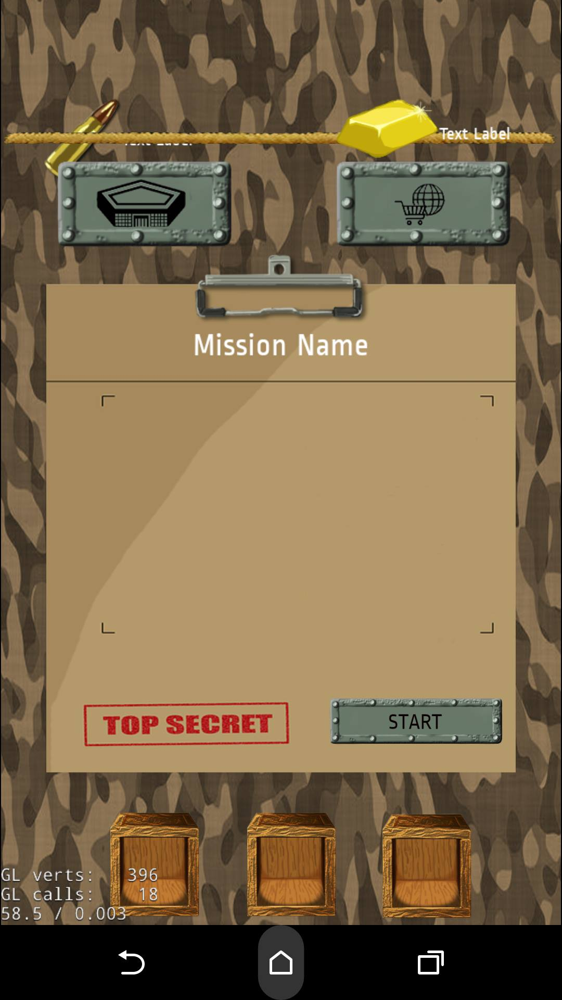
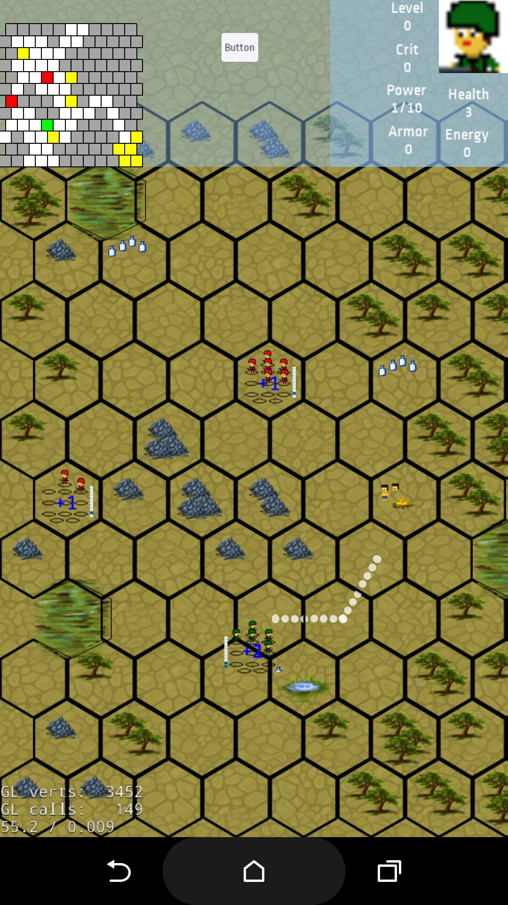
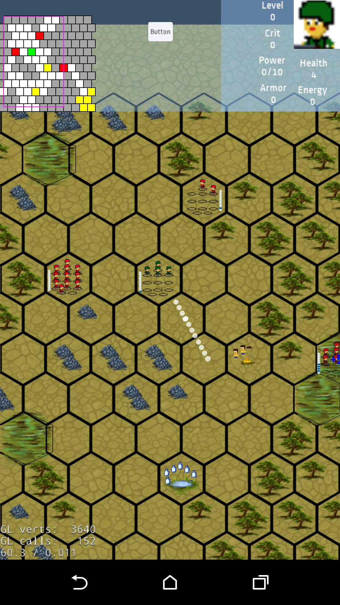

# Cells
Turn based mobile game.
=======

This is my first mobile game written in c++. It is not published, but in future time i will definitely release it for iOS and Android. 

- Release date: --
- Time to write the game - ~80 hours spread over 4 months.
- All graphics are pixel art made by Ivan Atanassov
- The game is using Cocos2DX open source game platform.
- You can find all the code in the Classes folder.
- For running the game, you must instal cocos2dx and python.

Here are a bunch of screenshots:

